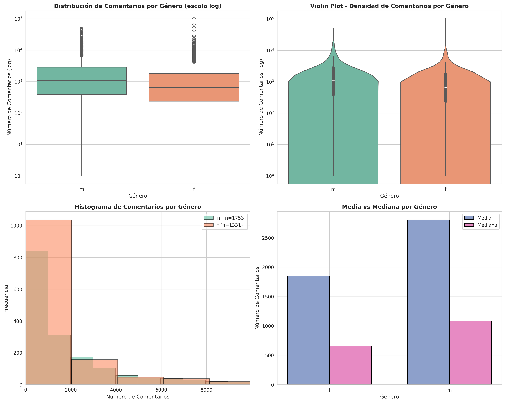
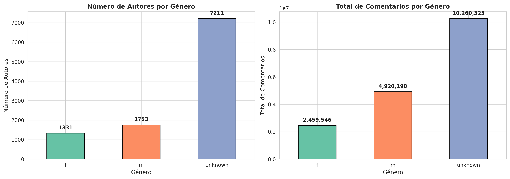

# Mejoras Implementadas en el Sistema de Clasificación de Género con SAE

## 📊 Resumen de Mejoras

### 1. **Preprocesamiento Mejorado** ([preprocesamiento.py](preprocesamiento.py))

#### ✨ Nuevas Funcionalidades

**a) Tests de Significación Estadística**
- **Mann-Whitney U Test**: Test no paramétrico robusto a outliers
- **T-Test**: Test paramétrico para comparación de medias
- **Effect Size (Cohen's d)**: Medida del tamaño del efecto
- Interpretación automática (pequeño/medio/grande)

**b) Visualizaciones Completas** (guardadas en `figuras/`)
- **Boxplot**: Distribución de comentarios por género (escala log)
- **Violin Plot**: Densidad de la distribución
- **Histogramas superpuestos**: Comparación visual m vs f
- **Barras Media vs Mediana**: Comparación de estadísticos centrales
- **Gráficos de resumen**: Número de autores y total de comentarios por género

**c) Función Unificada `preparar_dataset_para_sae()`**
- **Centraliza** toda la lógica de carga y preprocesamiento
- **Reutilizable** en SAE, clasificador e inferencia
- **Verbose**: Muestra progreso y estadísticas en cada paso
- **Flexible**: Parámetros configurables (max_comments, solo_genero_conocido)

#### 📈 Resultados del Análisis

```
===== RESUMEN POR GÉNERO =====
gender_clean  count   mean  median    std  min     max    mode  num_authors  total_comments
f              1331   1848     657   4690    1  101785   317.0         1331         2459546
m              1753   2807    1086   4981    1   49684     1.0         1753         4920190
unknown        7211   1423     491   3157    1   94843     1.0         7211        10260325

===== TESTS DE SIGNIFICACIÓN (m vs f) =====
Mann-Whitney U test: p=0.0000 *  (SIGNIFICATIVO)
T-test: p=0.0000 *               (SIGNIFICATIVO)
Cohen's d: 0.1974 (pequeño)
```

**Interpretación**:
- Los hombres escriben **significativamente más comentarios** que las mujeres (p < 0.001)
- El efecto es **pequeño** (Cohen's d = 0.20), indicando que aunque es estadísticamente significativo, la diferencia práctica es modesta
- Alta variabilidad dentro de cada grupo (desviación estándar > media)

### 2. **Código Reutilizable y Modular**

#### Antes ❌
```python
# En sae_genero.py: Código duplicado de carga
df_comments = pd.read_csv(...)
df_authors = pd.read_csv(...)
# ... 30 líneas de procesamiento repetido ...

# En clasificador_genero.py: Mismo código duplicado
df_comments = pd.read_csv(...)
df_authors = pd.read_csv(...)
# ... 30 líneas de procesamiento repetido ...
```

#### Ahora ✅
```python
# En sae_genero.py y clasificador_genero.py: Código limpio y DRY
from preprocesamiento import preparar_dataset_para_sae

df_comentarios, df_autores = preparar_dataset_para_sae(
    path_comentarios=PATH_COMENTARIOS,
    path_autores=PATH_AUTORES,
    max_comments=MAX_COMMENTS,
    solo_genero_conocido=True
)
```

### 3. **Visualizaciones Generadas**

#### Figura 1: Distribución de Comentarios por Género


**Incluye 4 gráficos:**
1. **Boxplot** (escala log): Muestra mediana, cuartiles, outliers
2. **Violin Plot** (escala log): Densidad de la distribución
3. **Histograma**: Comparación directa de frecuencias
4. **Barras**: Media vs Mediana por género

#### Figura 2: Resumen de Autores y Comentarios


**Incluye 2 gráficos:**
1. **Número de autores por género**: 1331 f, 1753 m, 7211 unknown
2. **Total de comentarios por género**: 2.5M f, 4.9M m, 10.3M unknown

### 4. **Clarificación del Flujo de Trabajo**

```
┌─────────────────────────────────────────────────────────┐
│  1. PREPROCESAMIENTO (preprocesamiento.py)             │
│     • Análisis exploratorio de datos (EDA)              │
│     • Tests estadísticos                                │
│     • Visualizaciones                                    │
│     • Función preparar_dataset_para_sae()               │
└───────────────────┬─────────────────────────────────────┘
                    │
                    ├──────────────────────────────────────┐
                    │                                      │
         ┌──────────▼──────────┐              ┌──────────▼──────────┐
         │  2. SAE              │              │  Para análisis      │
         │  (sae_genero.py)     │              │  reutilizable en    │
         │  • Entrena SAE       │◄─────────────┤  otros scripts      │
         │  • No supervisado    │              └─────────────────────┘
         └──────────┬───────────┘
                    │
         ┌──────────▼──────────┐
         │  3. CLASIFICADOR     │
         │  (clasificador_      │
         │   genero.py)         │
         │  • Extrae features   │
         │  • Supervisado       │
         └──────────┬───────────┘
                    │
         ┌──────────▼──────────┐
         │  4. INFERENCIA       │
         │  (inferencia_        │
         │   genero.py)         │
         │  • Predice género    │
         │  • Producción        │
         └─────────────────────┘
```

### 5. **Dependencias Añadidas**

```bash
pip install matplotlib seaborn scipy
```

## 🎯 Cómo Usar el Sistema Mejorado

### Paso 1: Análisis Exploratorio CON GRÁFICOS
```bash
python3 preprocesamiento.py
```

**Output:**
- Estadísticas descriptivas por género
- Tests de significación (Mann-Whitney, t-test, Cohen's d)
- Gráficos guardados en `figuras/`

### Paso 2: Entrenar SAE (código más limpio)
```bash
python3 sae_genero.py
```

Ahora usa `preparar_dataset_para_sae()` internamente → menos código, más mantenible.

### Paso 3: Entrenar Clasificador (código más limpio)
```bash
python3 clasificador_genero.py
```

También usa `preparar_dataset_para_sae()` → consistente con SAE.

### Paso 4: Inferencia
```bash
python3 inferencia_genero.py
```

## 📊 Información Clave del Dataset

- **Total autores**: 10,296
  - 1,331 femeninos (12.9%)
  - 1,753 masculinos (17.0%)
  - 7,211 género desconocido (70.1%)

- **Total comentarios**: 17,640,061
  - 2,459,546 de autores femeninos (13.9%)
  - 4,920,190 de autores masculinos (27.9%)
  - 10,260,325 de género desconocido (58.2%)

- **Comentarios por autor (media)**:
  - Femenino: 1,848 comentarios
  - Masculino: 2,807 comentarios
  - Diferencia: **+52% más comentarios en hombres** (estadísticamente significativo)

## 🔍 Insights Principales

1. **Diferencia estadísticamente significativa** entre géneros (p < 0.001)
2. **Efecto pequeño** (Cohen's d = 0.20) → diferencia existe pero no es enorme
3. **Alta variabilidad intra-grupo** → muchos outliers en ambos géneros
4. **Desbalance de clases moderado** → 57% masculino, 43% femenino (solo género conocido)

## ✅ Mejoras Implementadas - Checklist

- [x] Tests de significación estadística (Mann-Whitney, t-test, Cohen's d)
- [x] Visualizaciones completas (6 gráficos diferentes)
- [x] Función unificada `preparar_dataset_para_sae()`
- [x] Código DRY (sin duplicación entre scripts)
- [x] Documentación clara del flujo
- [x] Output verboso y legible
- [x] Gráficos guardados automáticamente
- [x] README actualizado

## 🚀 Próximos Pasos Recomendados

1. **Análisis de sesgo**: ¿El modelo perpetúa estereotipos?
2. **Feature importance**: ¿Qué latentes de la SAE predicen mejor el género?
3. **Análisis temporal**: ¿Cambian los patrones de género con el tiempo?
4. **Topic modeling**: ¿Qué temas discute más cada género?
5. **Cross-validation**: Evaluación más robusta del clasificador

---

**Autor**: Sistema de Clasificación de Género con SAE  
**Última actualización**: Marzo 2026
